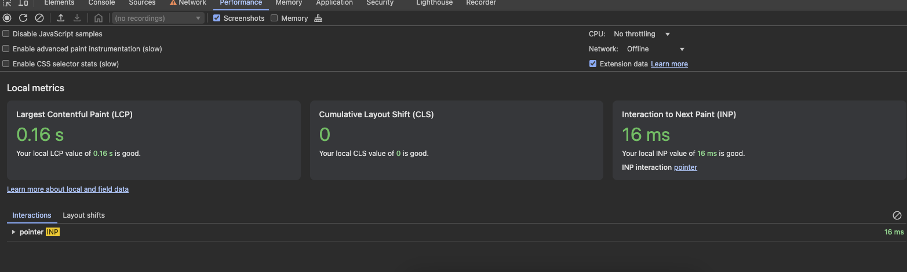
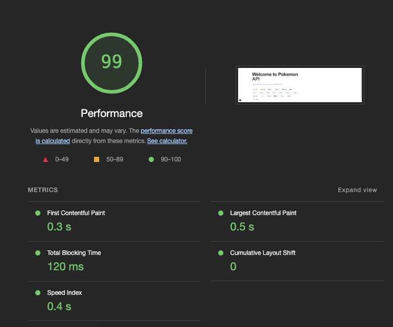
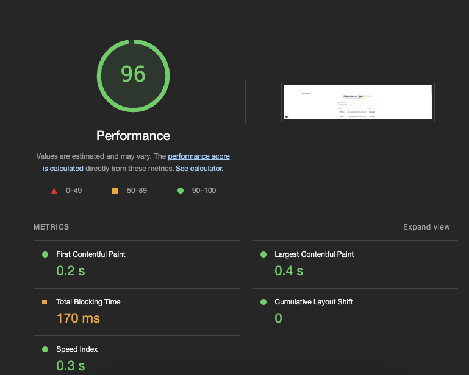

# Pokemon Project

This is a Next.js project that displays a list of Pokemon types and allows users to view Pokemon by type.

## Getting Started

### Prerequisites

Make sure you have the following installed:

- Node.js
- npm or yarn

### Installation

1. Clone the repository:

   ```bash
   git clone https://github.com/your-username/pokemon-project.git
   cd pokemon-project
   ```

2. Install dependencies:

   ```bash
   npm install
   # or
   yarn install
   ```

### Running the Development Server

To start the development server, run:

```bash
npm run dev
# or
yarn dev
```

Open [http://localhost:3000](http://localhost:3000) with your browser to see the result.

### Building for Production

To build the project for production, run:

```bash
npm run build
# or
yarn build
```

### Tailwind CSS Configuration

Tailwind CSS is configured in the `tailwind.config.ts` file. Ensure that the paths in the `content` array include all the relevant files.

### Project Structure

```
/pages
  /types
    [name].tsx
/components
  /pokemon
    pokemon-type-list.tsx
  /ui
    button.tsx
/api
  pokeApi.ts
/types
  Pokemon.ts
/styles
  globals.css
```

### Web Core Vitals

Web Core Vitals are essential metrics for understanding and improving the performance of your web application. Here are the metrics for this project:

- **Largest Contentful Paint (LCP)**: 0.16s
- **Cumulative Layout Shift (CLS)**: 0
- **Interaction to Next Paint (INP)**: 16ms
  

These metrics indicate that the project performs exceptionally well, with quick load times and minimal layout shifts.

### Performance Metrics

- **Initial Page Performance**: 99
  
- **Table Page Performance**: 97
  
  These scores reflect the high performance of the application, ensuring a smooth and responsive user experience.
